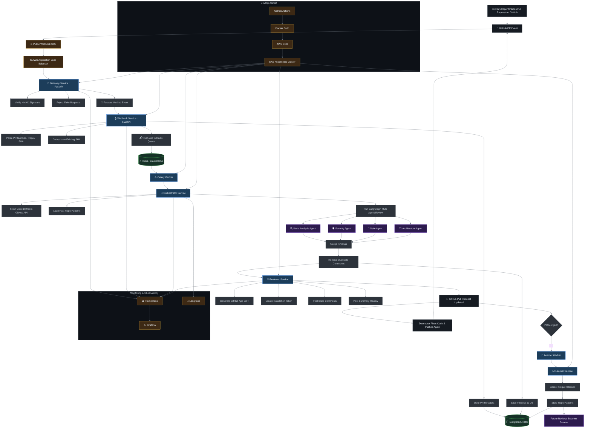

# diff-review-bot

GitHub App that runs **LLM review agents** on a pull request diff and posts inline comments.

Four agents look at the same patch in parallel (static, security, style, architecture), share one LangGraph state, then a reviewer writes comments on the PR. After merge, frequent issues are stored so later reviews on that repo are not starting from zero.

## About

This project is a working example of **multi-agent LLM orchestration** wired into a real developer workflow — not a chatbot in a notebook.

- **Agents** — specialized reviewers, each with its own prompt and job
- **LangGraph** — shared state, parallel fan-out, merge of findings
- **LLM** — model calls traced (prompts, tokens, cost)
- **Product loop** — GitHub webhook in, comments out, patterns remembered on merge

The rest of the stack (queue, GitHub App, k8s) exists so those agents can run on a live PR.

## Features

- GitHub App webhook on `opened` / `synchronize` / merge
- HMAC verification at the edge
- Background jobs so GitHub is not blocked on the model
- Four review agents in parallel, then deduped findings
- Inline comments plus a summary review
- Repo-level patterns fed back into later style reviews

## Architecture

## Agents

All four run on the same diff. Findings land in shared graph state and are merged before anything is posted.

| Agent | Looks for |
| --- | --- |
| Static | Complexity, unused names, noisy diffs |
| Security | Secrets, injection, dangerous APIs |
| Style | Readability; also sees past issues for this repo |
| Architecture | Error handling, boundaries, odd dependencies |

Orchestrator owns the graph. Reviewer is not an agent — it only talks to GitHub.

## Stack

| Layer | What |
| --- | --- |
| Agents / LLM | LangGraph, OpenAI, LangFuse |
| API | Python, FastAPI |
| Queue | Celery, Redis |
| Data | PostgreSQL |
| GitHub | GitHub App, webhooks |
| Ship | Docker, GitHub Actions, AWS ECR, EKS |
| Infra | Terraform |
| Watch | Prometheus, Grafana |

## How a review runs

1. GitHub sends a webhook to the public URL.
2. **Gateway** checks the HMAC signature and forwards the payload.
3. **Webhook** stores the PR and pushes a job onto Redis.
4. A **worker** calls **Orchestrator**, which pulls the diff and runs the four agents.
5. **Reviewer** posts inline comments and a summary with the GitHub App token.
6. If the PR is merged, **Learner** stores frequent issue patterns for that repo.

## Status

Early. Architecture and stack above are the target. Install and run steps will land here as the services exist.
