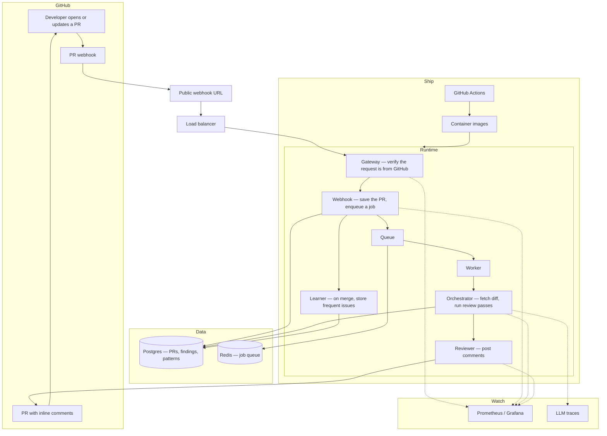

# diff-review-bot

GitHub App that reviews a pull request diff and posts inline comments.

When a developer opens or updates a PR, the bot fetches the changed lines, runs several review passes in parallel (static, security, style, architecture), and writes findings back on the PR. After a merge, it stores frequent issues so later reviews on that repo can take them into account.

